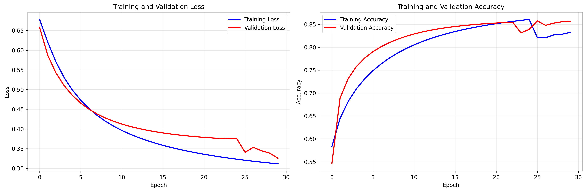
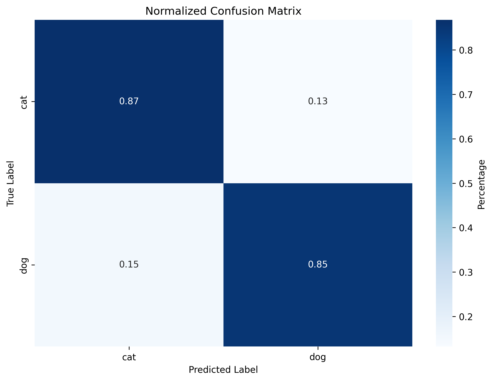

# 🐱🐶 基于CNN的猫狗图像分类系统


一个使用卷积神经网络(CNN)实现的猫狗图像分类系统，在测试集上达到**85.76%**的准确率。

## 📊 项目成果

| 指标 | 结果 |
|------|------|
| 测试准确率 | 85.76% |
| 猫识别准确率 | 86.75% |
| 狗识别准确率 | 84.78% |
| 模型参数量 | 3.6M (轻量级) |
| 训练样本数 | 8,005张 |
| 测试样本数 | 2,023张 |

## 🚀 快速开始

### 环境要求
- Python 3.8+
- PyTorch 2.0+
- CUDA (可选，用于GPU加速)

### 安装依赖
```bash
pip install -r requirements.txt
```

### 数据准备
将猫狗图像按以下结构组织：
```
data/
├── train/
│   ├── cats/
│   └── dogs/
├── val/
│   ├── cats/
│   └── dogs/
└── test/
    ├── cats/
    └── dogs/
```

### 模型训练
```bash
python train_light.py
```

### 模型评估
```bash
python evaluate_light.py
```

### 单张图片预测
```bash
python predict.py path/to/your/image.jpg
```

## 🏗 项目结构
```
cat_dog_cnn/
├── data/                    # 数据目录
├── models/                  # 训练好的模型
│   └── light_best_model.pth
├── utils/                   # 工具包
├── train_light.py           # 轻量模型训练
├── evaluate_light.py        # 模型评估
├── predict.py               # 单张图片预测
├── light_model.py           # 轻量CNN模型
├── model.py                 # 完整CNN模型
├── utils_english.py         # 英文可视化工具
├── requirements.txt         # 依赖列表
└── README.md               # 项目说明
```

## 🛠 技术细节

### 模型架构
- **输入尺寸**: 224×224×3
- **卷积层**: 4个卷积块，包含BatchNorm和Dropout
- **池化层**: 自适应平均池化
- **全连接层**: 2层MLP
- **输出**: 2分类 (猫/狗)

### 训练配置
- **损失函数**: CrossEntropyLoss
- **优化器**: Adam (lr=0.001)
- **数据增强**: 随机翻转、旋转、色彩调整
- **早停策略**: 验证集准确率连续7轮不提升

### 超参数
```python
{
    'batch_size': 32,
    'learning_rate': 0.001,
    'epochs': 30,
    'patience': 7,
    'weight_decay': 1e-4
}
```

## 📈 性能评估

### 分类报告
```
              precision    recall  f1-score   support

        cats     0.8506    0.8675    0.8590      1011
        dogs     0.8649    0.8478    0.8563      1012

    accuracy                         0.8576      2023
   macro avg     0.8578    0.8576    0.8576      2023
weighted avg     0.8578    0.8576    0.8576      2023
```

### 训练曲线


### 混淆矩阵


## 🎯 主要特性

- ✅ **轻量模型**: 仅3.6M参数，训练和推理速度快
- ✅ **高准确率**: 85.76%的测试准确率
- ✅ **类别平衡**: 猫狗识别率相近，无偏向性
- ✅ **完整流程**: 数据准备→训练→评估→可视化
- ✅ **易于使用**: 简单的命令行接口

## 🤝 贡献

欢迎提交Issue和Pull Request来改进这个项目！

## 📄 许可证

本项目采用MIT许可证 - 查看 [LICENSE](LICENSE) 文件了解详情。

## 🙏 致谢

- 感谢PyTorch团队提供的深度学习框架
- 感谢Kaggle提供的猫狗数据集
